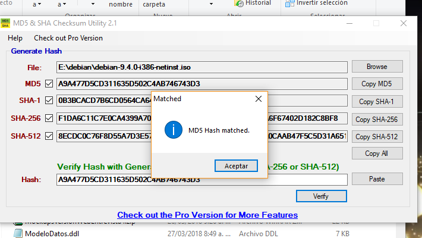
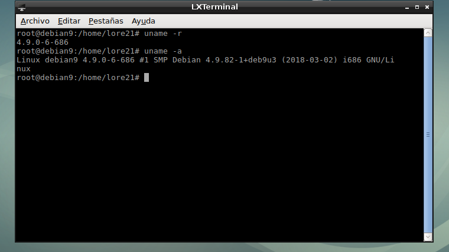
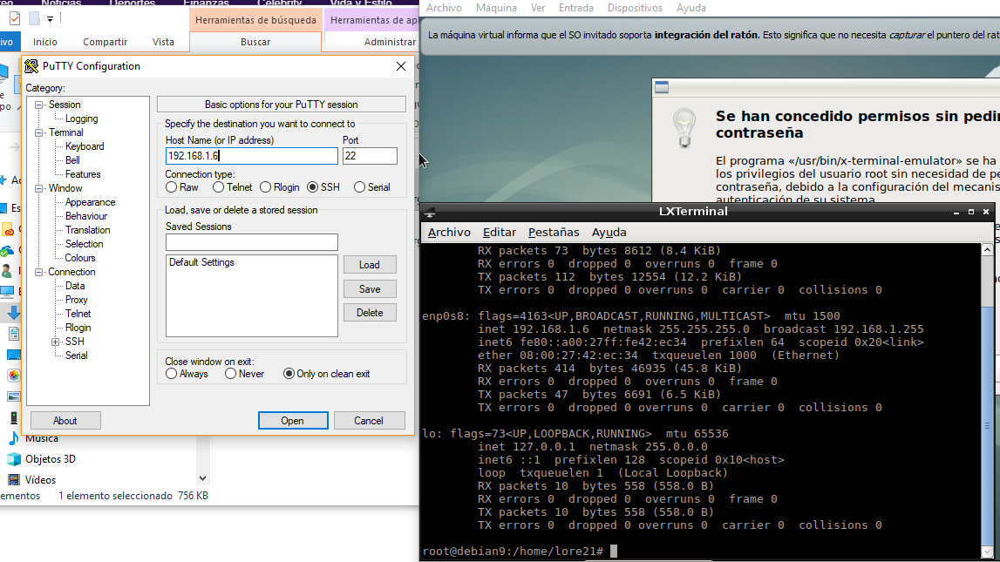
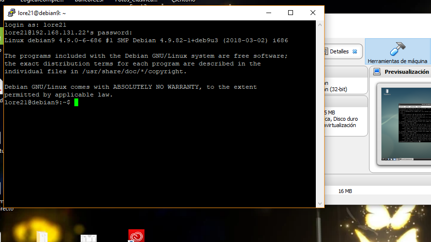

# **Examen 1** 

# **Universidad ICESI**

**Curso:** Sistemas Operativos

**Nombre:** Angie Lorena Pérez.

**Codigo:** A00242068.

**Tema:** Comandos de Linux, Virtualización

**Correo:** lorena9221@hotmail.com

**URL:**  https://github.com/AlorenaP/so-exam1

**Descripción**

El primer parcial del curso sistemas operativos trata sobre la instalación de sistemas operativos versión servidor, el manejo de comandos de Linux y virtualización.

## Solución

# 1. Comprobacion de imagen

  - 1.	Se descargo la imagen de instalación del sistema operativo debian 9 de debian.org y el programa MD5_and SHA_CheckSum_Utility para la comprobación de la imagen. 
  
  - 2.	Se ejecuta el MD5 y se carga la imagen del sistema operativo debian 9, a continuación, se comprueba: sha-1, sha-256 sha512 y por último se ingresa el hash correspondiente a la versión y arquitectura del debian 9 que se está verificando, damos clic en verify y el resultado es el siguiente: 
  
  .png)
  

# 2.  Instalacion de debian 9

- 1.	Al tener virtualbox instalado se procede a crear la maquina virtual debian 9 de 32 bits, se le define un tamaño de memoria, se crea el disco duro virtual (VDI) con almacenamiento reservado dinámicamente.

- 2.	Luego vamos a la opción configuración, aquí en sistema deshabilitamos de orden de arranque la opción de disquete, en la pestaña de procesador seleccionamos cuantos núcleos queremos o los que la maquina física permita (1 en este caso). Ahora en almacenamiento seleccionamos en unidad óptica la imagen de nuestro debian 9 verificamos que si cargue, para luego pasar a configurar la Red donde habilitamos el adaptador 1 ( NAT) para tener internet, también habilitamos el adaptador 2 (adaptador puente) porque más adelante se va a necesitar para conectarnos remotamente. Aceptamos.
- 3.	Al iniciar la máquina, se procede a instalar el sistema operativo por medio de la opción de instalación gráfica: 
  - 1.	Seleccionamos el idioma español.
  - 2.	Seleccionamos Colombia como ubicación.
  - 3.	Configuramos el teclado como latinoamericano.
  - 4.	Se empiezan a cargar las configuraciones.
  - 5.	Configuramos la red, damos un nombre a la maquina (debian).
  - 6.	Configuramos usuarios, se introduce la clave del super usuario
  - 7.	Se crea el usuario, con nombre (lore21) y contraseña.
  - 8.	Partición de disco (guiado- utilizar todo el disco).
  - 9.	Se selecciono, todos los ficheros en una partición.
  - 10.	Configuración del gestor de paquetes, donde seleccionamos el país de la réplica de debian (Colombia).
  - 11.	Selección de programas, donde checkie: utilidades estándar del sistema, LXDE.
  - 12.	Instalar el cargador de arranque <GRUP> si
  - 13.	Carga archivos y se termina la instalación
  - 14.	Por último, se reinicia la máquina.
  
  con el siguiente comando obtenemos la informacion del sistema operativo que se instalo.
  
  `uname -a`
  
  
  
   tambien se uso el comando
   
   `sudo lsb_release -a`
   
   .png)
   
  
# 3.	Conexión con putty
  En la configuración de putty se verifica que la máquina virtual este corriendo y tenga acceso a internet, luego en putty se configura la conexión especificando la IP de la máquina virtual la que se configuro en la interfaz enp0s8, la comunicación por medio del protocolo SSH, con puerto 22 para este protocolo.
  
  
  
  
  
 # 4.  Instalacion de git y tig 
  
   instalacion de git con el comando `sudo apt-get install git`
   
   instalacionde tig con el comando `sudo apt-get install tig`
 
  .png)
 
 
 # 5.  Importacion de la maquina virtual
 
  
  
  
  
  
  
  
  
  
  
  
  
  # 6. Cuadro comparativo
  
  
  | **Caracteristica** | **Debian 9** | **CentOS 7** |
  | :----------------- | :------------ | :------------|
  | Gestionde actualizaciones | Utiliza  APT (Advanced Packaging Toll) como paquete de gestión de las actualizaciones la cual sirve para actualizar el sistema. | Utiliza YUM (Yellow dog Updater, Modified) como paquete de gestión de las actualizaciones,sirve para actualizar el sistema e instalar las herramientas necesarias para el buen funcionamiento del sistema. |
  | Sistema de archivos | se le puede configurar el que prefiera entre los sistemas de archivos existentes para linux. | XFS es el sistema de archivos por defecto y permite escalar la capacidad de almacenamiento del sistema hasta 500 terabytes. |
  | Estabilidad | Tiene paquetes más antiguos, pero mucho más estables (más testeados y cuyas actualizaciones se basan en la misma versión estable) | Solo se lanzan versiones verdaderamente estables |
  | Soporte | Recibe soporte durante 3-4 años | Recibe soporte durante mucho más tiempo |
  | Kernel Configurable | si | si |
  |Enfocado en seguridad | si | no |
  | Mantenimiento | Ofrece soporte a largo plazo (LTS) durante cinco años después de la fecha de lanzamiento inicial. | Tienen actualizaciones de mantenimiento durante 10 años |
  | GUI | si | si |
  | Multiples Plataformas | 32bits, 64bits, ARM, PowerPC | 64bits |
  | Comunidad| Alta | Media |

